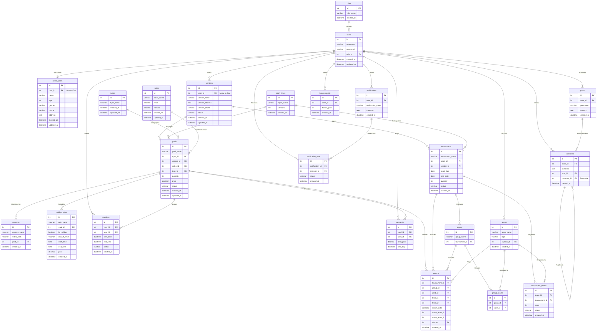

# Tài liệu Chi tiết Cấu trúc Thực thể (Database Schema & ERD)

Tài liệu này mô tả chi tiết toàn bộ cơ sở dữ liệu của dự án **sporting_web** dựa trên các thực thể (Entities) đã được chuẩn hóa và khai báo trong mã nguồn.

---

## 1. Sơ đồ Quan hệ Thực thể (Mermaid ERD)

Dưới đây là sơ đồ quan hệ giữa các thực thể trong hệ thống:



---

## 2. Chi tiết cấu trúc từng Thực thể (Entities Specification)

### 2.1. Phân hệ Người dùng & Phân quyền (User & Auth)

#### Bảng `roles` (Thực thể `Role`)
*   **Mô tả:** Định nghĩa các vai trò/phân quyền trong hệ thống.
*   **Cấu trúc:**
    | Tên Cột DB | Thuộc tính Code | Kiểu DB | Kiểu Code | Ràng buộc |
    | :--- | :--- | :--- | :--- | :--- |
    | `id` | `id` | `int` | `number` | PK, Tự tăng |
    | `role_name` | `roleName` | `varchar(255)` | `string` | Không null |
    | `created_at` | `createdAt` | `datetime` | `Date` | Mặc định: `CURRENT_TIMESTAMP` |

#### Bảng `users` (Thực thể `User`)
*   **Mô tả:** Tài khoản đăng nhập hệ thống của tất cả người dùng (Khách hàng, Vendor, Admin).
*   **Cấu trúc:**
    | Tên Cột DB | Thuộc tính Code | Kiểu DB | Kiểu Code | Ràng buộc |
    | :--- | :--- | :--- | :--- | :--- |
    | `id` | `id` | `int` | `number` | PK, Tự tăng |
    | `username` | `username` | `varchar(255)` | `string` | Không null, Duy nhất |
    | `password` | `password` | `varchar(255)` | `string` | Không null |
    | `role_id` | `role` | `int` | `Role` | FK trỏ đến `roles(id)` |
    | `created_at` | `createdAt` | `datetime` | `Date` | Mặc định: `CURRENT_TIMESTAMP` |
    | `updated_at` | `updatedAt` | `datetime` | `Date` | Mặc định: `CURRENT_TIMESTAMP` |

#### Bảng `detail_users` (Thực thể `DetailUser`)
*   **Mô tả:** Thông tin cá nhân chi tiết của người dùng.
*   **Cấu trúc:**
    | Tên Cột DB | Thuộc tính Code | Kiểu DB | Kiểu Code | Ràng buộc |
    | :--- | :--- | :--- | :--- | :--- |
    | `id` | `id` | `int` | `number` | PK, Tự tăng |
    | `user_id` | `user` | `int` | `User` | FK trỏ đến `users(id)`, One-to-One |
    | `name` | `name` | `varchar(100)` | `string` | Nullable |
    | `age` | `age` | `int` | `number` | Nullable |
    | `gender` | `gender` | `varchar(10)` | `string` | Nullable |
    | `phone` | `phone` | `varchar(20)` | `string` | Nullable |
    | `address` | `address` | `text` | `string` | Nullable |
    | `created_at` | `createdAt` | `datetime` | `Date` | Mặc định: `CURRENT_TIMESTAMP` |
    | `updated_at` | `updatedAt` | `datetime` | `Date` | Mặc định: `CURRENT_TIMESTAMP` |

---

### 2.2. Phân hệ Chủ sân & Đặt sân (Vendor & Yard)

#### Bảng `vendors` (Thực thể `Vendor`)
*   **Mô tả:** Thông tin chi tiết các nhà cung cấp/chủ sân bóng. Một người dùng có thể sở hữu nhiều vendor.
*   **Cấu trúc:**
    | Tên Cột DB | Thuộc tính Code | Kiểu DB | Kiểu Code | Ràng buộc |
    | :--- | :--- | :--- | :--- | :--- |
    | `id` | `id` | `int` | `number` | PK, Tự tăng |
    | `user_id` | `user` | `int` | `User` | FK trỏ đến `users(id)`, Many-to-One |
    | `vendor_name` | `vendorName` | `varchar(100)` | `string` | Không null |
    | `vendor_address`| `vendorAddress`| `text` | `string` | Nullable |
    | `vendor_phone` | `vendorPhone` | `varchar(20)` | `string` | Nullable |
    | `status` | `status` | `varchar(10)` | `string` | Nullable |
    | `created_at` | `createdAt` | `datetime` | `Date` | Mặc định: `CURRENT_TIMESTAMP` |
    | `updated_at` | `updatedAt` | `datetime` | `Date` | Mặc định: `CURRENT_TIMESTAMP` |

#### Bảng `sport_types` (Thực thể `SportType`)
*   **Mô tả:** Loại hình thể thao (ví dụ: Bóng đá 5 người, Bóng đá 7 người, Cầu lông, Tennis).
*   **Cấu trúc:**
    | Tên Cột DB | Thuộc tính Code | Kiểu DB | Kiểu Code | Ràng buộc |
    | :--- | :--- | :--- | :--- | :--- |
    | `id` | `id` | `int` | `number` | PK, Tự tăng |
    | `sport_name` | `sportName` | `varchar(100)` | `string` | Không null |
    | `vendors` | `vendors` | `text` | `string` | Nullable |
    | `created_at` | `createdAt` | `datetime` | `Date` | Mặc định: `CURRENT_TIMESTAMP` |

#### Bảng `types` (Thực thể `Types`)
*   **Mô tả:** Loại sân (ví dụ: Sân cỏ nhân tạo, Sân đất nện, Sân trong nhà).
*   **Cấu trúc:**
    | Tên Cột DB | Thuộc tính Code | Kiểu DB | Kiểu Code | Ràng buộc |
    | :--- | :--- | :--- | :--- | :--- |
    | `id` | `id` | `int` | `number` | PK, Tự tăng |
    | `type_name` | `typeName` | `varchar(100)` | `string` | Không null |
    | `created_at` | `createdAt` | `datetime` | `Date` | Mặc định: `CURRENT_TIMESTAMP` |
    | `updated_at` | `updatedAt` | `datetime` | `Date` | Mặc định: `CURRENT_TIMESTAMP` |

#### Bảng `sales` (Thực thể `Sale`)
*   **Mô tả:** Các chương trình khuyến mãi/giảm giá áp dụng cho sân bóng.
*   **Cấu trúc:**
    | Tên Cột DB | Thuộc tính Code | Kiểu DB | Kiểu Code | Ràng buộc |
    | :--- | :--- | :--- | :--- | :--- |
    | `id` | `id` | `int` | `number` | PK, Tự tăng |
    | `sales_name` | `salesName` | `varchar(100)` | `string` | Không null |
    | `price` | `price` | `decimal` | `number` | Không null |
    | `persent` | `persent` | `decimal` | `number` | Nullable (Tỷ lệ giảm %) |
    | `created_at` | `createdAt` | `datetime` | `Date` | Mặc định: `CURRENT_TIMESTAMP` |
    | `updated_at` | `updatedAt` | `datetime` | `Date` | Mặc định: `CURRENT_TIMESTAMP` |

#### Bảng `yards` (Thực thể `Yard`)
*   **Mô tả:** Thông tin các sân thể thao chi tiết.
*   **Cấu trúc:**
    | Tên Cột DB | Thuộc tính Code | Kiểu DB | Kiểu Code | Ràng buộc |
    | :--- | :--- | :--- | :--- | :--- |
    | `id` | `id` | `int` | `number` | PK, Tự tăng |
    | `yard_name` | `yardName` | `varchar(100)` | `string` | Không null |
    | `sport_id` | `sportType` | `int` | `SportType` | FK trỏ đến `sport_types(id)` |
    | `vendor_id` | `vendor` | `int` | `Vendor` | FK trỏ đến `vendors(id)` |
    | `sales_id` | `sale` | `int` | `Sale` | FK trỏ đến `sales(id)`, Nullable |
    | `type_id` | `typeYard` | `int` | `Types` | FK trỏ đến `types(id)` |
    | `quantity` | `quantity` | `int` | `number` | Không null |
    | `price` | `price` | `decimal` | `number` | Không null |
    | `status` | `status` | `varchar(10)` | `string` | Nullable |
    | `created_at` | `createdAt` | `datetime` | `Date` | Mặc định: `CURRENT_TIMESTAMP` |
    | `updated_at` | `updatedAt` | `datetime` | `Date` | Mặc định: `CURRENT_TIMESTAMP` |

#### Bảng `cameras` (Thực thể `Camera`)
*   **Mô tả:** Các camera được lắp ở sân bóng nhằm ghi hình trực tiếp trận đấu.
*   **Cấu trúc:**
    | Tên Cột DB | Thuộc tính Code | Kiểu DB | Kiểu Code | Ràng buộc |
    | :--- | :--- | :--- | :--- | :--- |
    | `id` | `id` | `int` | `number` | PK, Tự tăng |
    | `camera_name` | `cameraName` | `varchar(100)` | `string` | Không null |
    | `video_path` | `videoPath` | `varchar(255)` | `string` | Nullable |
    | `yard_id` | `yard` | `int` | `Yard` | FK trỏ đến `yards(id)` |
    | `created_at` | `createdAt` | `datetime` | `Date` | Mặc định: `CURRENT_TIMESTAMP` |

#### Bảng `pricing_rules` (Thực thể `PricingRule`)
*   **Mô tả:** Định nghĩa quy tắc tính giá sân theo khung giờ, ngày trong tuần, ngày lễ.
*   **Cấu trúc:**
    | Tên Cột DB | Thuộc tính Code | Kiểu DB | Kiểu Code | Ràng buộc |
    | :--- | :--- | :--- | :--- | :--- |
    | `id` | `id` | `int` | `number` | PK, Tự tăng |
    | `rule_name` | `ruleName` | `varchar(100)` | `string` | Không null |
    | `yard_id` | `yard` | `int` | `Yard` | FK trỏ đến `yards(id)` |
    | `is_holiday` | `isHoliday` | `boolean` | `boolean` | Không null |
    | `day_of_week` | `dayOfWeek` | `varchar(20)` | `string` | Nullable |
    | `start_time` | `startTime` | `time` | `string` | Không null |
    | `end_time` | `endTime` | `time` | `string` | Không null |
    | `price` | `price` | `decimal` | `number` | Không null |
    | `created_at` | `createdAt` | `datetime` | `Date` | Mặc định: `CURRENT_TIMESTAMP` |

---

### 2.3. Phân hệ Giao dịch & Tương tác (Transaction & Social)

#### Bảng `bookings` (Thực thể `Booking`)
*   **Mô tả:** Lịch sử và thông tin đặt sân bóng của khách hàng.
*   **Cấu trúc:**
    | Tên Cột DB | Thuộc tính Code | Kiểu DB | Kiểu Code | Ràng buộc |
    | :--- | :--- | :--- | :--- | :--- |
    | `id` | `id` | `int` | `number` | PK, Tự tăng |
    | `yard_id` | `yard` | `int` | `Yard` | FK trỏ đến `yards(id)` |
    | `user_id` | `user` | `int` | `User` | FK trỏ đến `users(id)` |
    | `start_time` | `startTime` | `datetime` | `Date` | Không null |
    | `end_time` | `endTime` | `datetime` | `Date` | Không null |
    | `status` | `status` | `varchar(20)` | `string` | Nullable |
    | `created_at` | `createdAt` | `datetime` | `Date` | Mặc định: `CURRENT_TIMESTAMP` |

#### Bảng `payments` (Thực thể `Payment`)
*   **Mô tả:** Thông tin giao dịch thanh toán khi đặt sân.
*   **Cấu trúc:**
    | Tên Cột DB | Thuộc tính Code | Kiểu DB | Kiểu Code | Ràng buộc |
    | :--- | :--- | :--- | :--- | :--- |
    | `id` | `id` | `int` | `number` | PK, Tự tăng |
    | `yard_id` | `yard` | `int` | `Yard` | FK trỏ đến `yards(id)` |
    | `user_id` | `user` | `int` | `User` | FK trỏ đến `users(id)` |
    | `total_price` | `totalPrice` | `decimal` | `number` | Không null |
    | `time_buy` | `timeBuy` | `datetime` | `Date` | Mặc định: `CURRENT_TIMESTAMP` |

#### Bảng `bonus_points` (Thực thể `BonusPoint`)
*   **Mô tả:** Điểm thưởng tích luỹ của khách hàng qua từng giao dịch.
*   **Cấu trúc:**
    | Tên Cột DB | Thuộc tính Code | Kiểu DB | Kiểu Code | Ràng buộc |
    | :--- | :--- | :--- | :--- | :--- |
    | `id` | `id` | `int` | `number` | PK, Tự tăng |
    | `user_id` | `user` | `int` | `User` | FK trỏ đến `users(id)` |
    | `bonus_point` | `bonusPoint` | `int` | `number` | Mặc định: `0` |
    | `created_at` | `createdAt` | `datetime` | `Date` | Mặc định: `CURRENT_TIMESTAMP` |

#### Bảng `posts` (Thực thể `Post`)
*   **Mô tả:** Các bài đăng trên diễn đàn hoặc mạng xã hội nội bộ.
*   **Cấu trúc:**
    | Tên Cột DB | Thuộc tính Code | Kiểu DB | Kiểu Code | Ràng buộc |
    | :--- | :--- | :--- | :--- | :--- |
    | `id` | `id` | `int` | `number` | PK, Tự tăng |
    | `user_id` | `user` | `int` | `User` | FK trỏ đến `users(id)` |
    | `postname` | `postname` | `varchar(150)` | `string` | Không null |
    | `content` | `content` | `text` | `string` | Không null |
    | `created_at` | `createdAt` | `datetime` | `Date` | Mặc định: `CURRENT_TIMESTAMP` |

#### Bảng `comments` (Thực thể `Comment`)
*   **Mô tả:** Các bình luận trên bài đăng diễn đàn. Có liên kết đệ quy để biểu thị trả lời bình luận (threaded replies). Mapped từ bảng `notifications` ở góc phải trên cùng ERD để tránh trùng tên.
*   **Cấu trúc:**
    | Tên Cột DB | Thuộc tính Code | Kiểu DB | Kiểu Code | Ràng buộc |
    | :--- | :--- | :--- | :--- | :--- |
    | `id` | `id` | `int` | `number` | PK, Tự tăng |
    | `posts_id` | `post` | `int` | `Post` | FK trỏ đến `posts(id)` |
    | `comment` | `comment` | `text` | `string` | Không null |
    | `user_id` | `user` | `int` | `User` | FK trỏ đến `users(id)` |
    | `comment_id` | `parentComment`| `int` | `Comment` | FK trỏ đến chính nó, Nullable |
    | `created_at` | `createdAt` | `datetime` | `Date` | Mặc định: `CURRENT_TIMESTAMP` |

#### Bảng `notifications` (Thực thể `Notification`)
*   **Mô tả:** Nội dung thông báo hệ thống được tạo bởi người dùng (hoặc hệ thống).
*   **Cấu trúc:**
    | Tên Cột DB | Thuộc tính Code | Kiểu DB | Kiểu Code | Ràng buộc |
    | :--- | :--- | :--- | :--- | :--- |
    | `id` | `id` | `int` | `number` | PK, Tự tăng |
    | `user_id` | `user` | `int` | `User` | FK trỏ đến `users(id)` |
    | `notification_name`| `notificationName`| `varchar(150)`| `string` | Không null |
    | `contents` | `contents` | `text` | `string` | Không null |
    | `created_at` | `createdAt` | `datetime` | `Date` | Mặc định: `CURRENT_TIMESTAMP` |

#### Bảng `notification_user` (Thực thể `NotificationUser`)
*   **Mô tả:** Bảng liên kết theo dõi xem người dùng nào nhận được thông báo nào và trạng thái (đã đọc/chưa đọc).
*   **Cấu trúc:**
    | Tên Cột DB | Thuộc tính Code | Kiểu DB | Kiểu Code | Ràng buộc |
    | :--- | :--- | :--- | :--- | :--- |
    | `id` | `id` | `int` | `number` | PK, Tự tăng |
    | `notification_id`| `notification`| `int` | `Notification` | FK trỏ đến `notifications(id)` |
    | `receiver_id` | `receiver` | `int` | `User` | FK trỏ đến `users(id)` |
    | `status` | `status` | `varchar(20)` | `string` | Nullable |
    | `created_at` | `createdAt` | `datetime` | `Date` | Mặc định: `CURRENT_TIMESTAMP` |

---

### 2.4. Phân hệ Giải đấu & Câu lạc bộ (Tournament & Team)

#### Bảng `tournaments` (Thực thể `Tournament`)
*   **Mô tả:** Các giải đấu thể thao do các Vendor đứng ra tổ chức.
*   **Cấu trúc:**
    | Tên Cột DB | Thuộc tính Code | Kiểu DB | Kiểu Code | Ràng buộc |
    | :--- | :--- | :--- | :--- | :--- |
    | `id` | `id` | `int` | `number` | PK, Tự tăng |
    | `tournament_name`| `tournamentName`| `varchar(150)`| `string` | Không null |
    | `sport_id` | `sportType` | `int` | `SportType` | FK trỏ đến `sport_types(id)` |
    | `vendor_id` | `vendor` | `int` | `Vendor` | FK trỏ đến `vendors(id)` |
    | `start_date` | `startDate` | `date` | `Date` | Không null |
    | `end_date` | `endDate` | `date` | `Date` | Không null |
    | `quantity` | `quantity` | `int` | `number` | Không null |
    | `status` | `status` | `varchar(20)` | `string` | Nullable |
    | `created_at` | `createdAt` | `datetime` | `Date` | Mặc định: `CURRENT_TIMESTAMP` |

#### Bảng `groups` (Thực thể `Group`)
*   **Mô tả:** Các bảng đấu nằm trong một giải đấu (ví dụ: Bảng A, Bảng B).
*   **Cấu trúc:**
    | Tên Cột DB | Thuộc tính Code | Kiểu DB | Kiểu Code | Ràng buộc |
    | :--- | :--- | :--- | :--- | :--- |
    | `id` | `id` | `int` | `number` | PK, Tự tăng |
    | `group_name` | `groupName` | `varchar(50)` | `string` | Không null |
    | `tournament_id`| `tournament`| `int` | `Tournament` | FK trỏ đến `tournaments(id)` |

#### Bảng `teams` (Thực thể `Team`)
*   **Mô tả:** Các câu lạc bộ/đội bóng đăng ký tham gia giải đấu.
*   **Cấu trúc:**
    | Tên Cột DB | Thuộc tính Code | Kiểu DB | Kiểu Code | Ràng buộc |
    | :--- | :--- | :--- | :--- | :--- |
    | `id` | `id` | `int` | `number` | PK, Tự tăng |
    | `team_name` | `teamName` | `varchar(100)` | `string` | Không null |
    | `logo` | `logo` | `varchar(255)` | `string` | Nullable |
    | `captain_id` | `captain` | `int` | `User` | FK trỏ đến `users(id)`, Nullable |
    | `created_at` | `createdAt` | `datetime` | `Date` | Mặc định: `CURRENT_TIMESTAMP` |

#### Bảng `group_teams` (Thực thể `GroupTeam`)
*   **Mô tả:** Bảng liên kết trung gian biểu thị đội bóng nào nằm trong bảng đấu nào.
*   **Cấu trúc:**
    | Tên Cột DB | Thuộc tính Code | Kiểu DB | Kiểu Code | Ràng buộc |
    | :--- | :--- | :--- | :--- | :--- |
    | `id` | `id` | `int` | `number` | PK, Tự tăng |
    | `group_id` | `group` | `int` | `Group` | FK trỏ đến `groups(id)` |
    | `team_id` | `team` | `int` | `Team` | FK trỏ đến `teams(id)` |

#### Bảng `tournament_teams` (Thực thể `TournamentTeam`)
*   **Mô tả:** Các đội bóng tham gia vào giải đấu cùng thông tin phân hạt giống (seed).
*   **Cấu trúc:**
    | Tên Cột DB | Thuộc tính Code | Kiểu DB | Kiểu Code | Ràng buộc |
    | :--- | :--- | :--- | :--- | :--- |
    | `id` | `id` | `int` | `number` | PK, Tự tăng |
    | `team_id` | `team` | `int` | `Team` | FK trỏ đến `teams(id)` |
    | `tournament_id`| `tournament`| `int` | `Tournament` | FK trỏ đến `tournaments(id)` |
    | `seed` | `seed` | `int` | `number` | Nullable |
    | `status` | `status` | `varchar(20)` | `string` | Nullable |
    | `created_at` | `createdAt` | `datetime` | `Date` | Mặc định: `CURRENT_TIMESTAMP` |

#### Bảng `matchs` (Thực thể `Match`)
*   **Mô tả:** Thông tin các trận đấu diễn ra trong khuôn khổ giải đấu.
*   **Cấu trúc:**
    | Tên Cột DB | Thuộc tính Code | Kiểu DB | Kiểu Code | Ràng buộc |
    | :--- | :--- | :--- | :--- | :--- |
    | `id` | `id` | `int` | `number` | PK, Tự tăng |
    | `tournament_id`| `tournament`| `int` | `Tournament` | FK trỏ đến `tournaments(id)` |
    | `group_id` | `group` | `int` | `Group` | FK trỏ đến `groups(id)` (Corrected "grounp_id" typo) |
    | `yard_id` | `yard` | `int` | `Yard` | FK trỏ đến `yards(id)` |
    | `team_1` | `team1` | `int` | `Team` | FK trỏ đến `teams(id)` |
    | `team_2` | `team2` | `int` | `Team` | FK trỏ đến `teams(id)` |
    | `match_date` | `matchDate` | `datetime` | `Date` | Không null |
    | `score_team_1` | `scoreTeam1` | `int` | `number` | Nullable |
    | `score_team_2` | `scoreTeam2` | `int` | `number` | Nullable |
    | `winner` | `winner` | `int` | `Team` | FK trỏ đến `teams(id)`, Nullable |
    | `created_at` | `createdAt` | `datetime` | `Date` | Mặc định: `CURRENT_TIMESTAMP` |

---

## 3. Hướng dẫn Kỹ thuật Thiết lập Mối quan hệ trong Code (TypeORM Relationship Guide)

Dưới đây là chi tiết kỹ thuật cách cấu hình và triển khai các mối quan hệ giữa các thực thể trong dự án sử dụng NestJS và TypeORM:

### 3.1. Quan hệ 1 - 1 (One-to-One Relationship)
*   **Định nghĩa:** Một bản ghi bảng A chỉ liên kết với một bản ghi bảng B.
*   **Ví dụ:** Tài khoản đăng nhập [User](file:///d:/Du_an/sporting/spoting_web/src/users/entities/user.entity.ts) và Thông tin cá nhân [DetailUser](file:///d:/Du_an/sporting/spoting_web/src/detail-users/entities/detail-user.entity.ts).
*   **Kỹ thuật cấu hình:**
    *   **Bên sở hữu khóa ngoại (DetailUser):** Sử dụng decorator `@OneToOne` cùng với `@JoinColumn({ name: 'user_id' })` để TypeORM sinh ra cột vật lý `user_id` trong bảng `detail_users`.
        ```typescript
        @OneToOne(() => User, (user) => user.detailUser, { nullable: false, onDelete: 'CASCADE' })
        @JoinColumn({ name: 'user_id' })
        user: User;
        ```
    *   **Bên nghịch đảo (User):** Chỉ cần khai báo `@OneToOne` và trỏ lại thuộc tính tương ứng ở DetailUser mà không cần `@JoinColumn`.
        ```typescript
        @OneToOne(() => DetailUser, (detailUser) => detailUser.user, { cascade: true })
        detailUser: DetailUser;
        ```

### 3.2. Quan hệ 1 - Nhiều (One-to-Many / Many-to-One)
*   **Định nghĩa:** Một bản ghi của bảng cha liên kết với nhiều bản ghi của bảng con.
*   **Ví dụ:** Một chủ sân [Vendor](file:///d:/Du_an/sporting/spoting_web/src/vendors/entities/vendor.entity.ts) sở hữu nhiều sân thể thao [Yard](file:///d:/Du_an/sporting/spoting_web/src/yards/entities/yard.entity.ts).
*   **Kỹ thuật cấu hình:**
    *   **Phía "Nhiều" (Yard - bảng con chứa khóa ngoại):** Sử dụng decorator `@ManyToOne` kết hợp với `@JoinColumn({ name: 'vendor_id' })` để tạo cột khóa ngoại `vendor_id`.
        ```typescript
        @ManyToOne(() => Vendor, (vendor) => vendor.yards, { nullable: true, onDelete: 'SET NULL' })
        @JoinColumn({ name: 'vendor_id' })
        vendor: Vendor;
        ```
    *   **Phía "Một" (Vendor - bảng cha):** Sử dụng decorator `@OneToMany` chỉ định kiểu mảng của thực thể con.
        ```typescript
        @OneToMany(() => Yard, (yard) => yard.vendor, { cascade: true })
        yards: Yard[];
        ```

### 3.3. Quan hệ Nhiều - Nhiều thông qua Thực thể Trung gian (Junction Entity)
*   **Định nghĩa:** Khi hai thực thể có quan hệ Nhiều - Nhiều nhưng cần lưu giữ các thuộc tính phụ (ví dụ: ngày đăng ký, trạng thái liên kết).
*   **Ví dụ:** Bảng liên kết đăng ký đội bóng vào giải đấu [TournamentTeam](file:///d:/Du_an/sporting/spoting_web/src/tournament-teams/entities/tournament-team.entity.ts) giữa `Tournament` và `Team` có thêm các thuộc tính `seed` (phân hạt giống) và `status` (trạng thái xét duyệt).
*   **Kỹ thuật cấu hình:** Tách thành một thực thể độc lập (`TournamentTeam`), trong đó chứa 2 mối quan hệ `@ManyToOne` trỏ về 2 bảng chính:
    ```typescript
    @Entity('tournament_teams')
    export class TournamentTeam {
      @PrimaryGeneratedColumn()
      id: number;

      @ManyToOne(() => Team, { onDelete: 'CASCADE' })
      @JoinColumn({ name: 'team_id' })
      team: Team; // FK trỏ đến Team

      @ManyToOne(() => Tournament, (tournament) => tournament.tournamentTeams, { onDelete: 'CASCADE' })
      @JoinColumn({ name: 'tournament_id' })
      tournament: Tournament; // FK trỏ đến Tournament

      @Column({ name: 'seed', nullable: true, type: 'int' })
      seed: number | null;

      @Column({ name: 'status', nullable: true, type: 'varchar', length: 20 })
      status: string | null;
    }
    ```

### 3.4. Quan hệ Đệ quy tự liên kết (Self-Referencing Relationship)
*   **Định nghĩa:** Một dòng trong bảng có thể trỏ đến khóa chính của một dòng khác nằm trong chính bảng đó.
*   **Ví dụ:** Bảng bình luận [Comment](file:///d:/Du_an/sporting/spoting_web/src/comments/entities/comment.entity.ts). Trường `comment_id` dùng để lưu ID của bình luận cha nhằm tạo cấu trúc cây thư mục (bình luận con trả lời bình luận cha).
*   **Kỹ thuật cấu hình:**
    ```typescript
    @Entity('comments')
    export class Comment {
      @PrimaryGeneratedColumn()
      id: number;

      // Nhiều bình luận con trỏ về cùng một bình luận cha (parentComment)
      @ManyToOne(() => Comment, (comment) => comment.replies, { nullable: true, onDelete: 'SET NULL' })
      @JoinColumn({ name: 'comment_id' })
      parentComment: Comment | null;

      // Một bình luận cha chứa nhiều bình luận con phản hồi (replies)
      @OneToMany(() => Comment, (comment) => comment.parentComment)
      replies: Comment[];
    }
    ```

### 3.5. Cấu hình hành vi khi Xóa bản ghi (onDelete)
Xác định hành vi của database đối với các bản ghi con khi bản ghi cha bị xóa:
1.  **`onDelete: 'CASCADE'`**: Khi bản ghi cha bị xóa, toàn bộ các bản ghi con liên quan sẽ **tự động bị xóa theo**.
    *   *Sử dụng khi:* Các thông tin phụ thuộc hoàn toàn (ví dụ: Xóa `User` thì tự động xóa hồ sơ `DetailUser` và điểm thưởng `BonusPoint`).
2.  **`onDelete: 'SET NULL'`**: Khi bản ghi cha bị xóa, giá trị khóa ngoại ở các bản ghi con liên quan sẽ tự động chuyển thành **`NULL`**.
    *   *Sử dụng khi:* Dữ liệu con có tính độc lập và cần giữ lại để thống kê (ví dụ: Xóa gói giảm giá `Sale` thì các sân `Yard` đang dùng gói đó sẽ có `sales_id = NULL`, không bị xóa sân bóng).
3.  **`onDelete: 'RESTRICT'` / `'NO ACTION'`**: Không cho phép xóa bản ghi cha nếu vẫn đang có bản ghi con tham chiếu đến nó.

